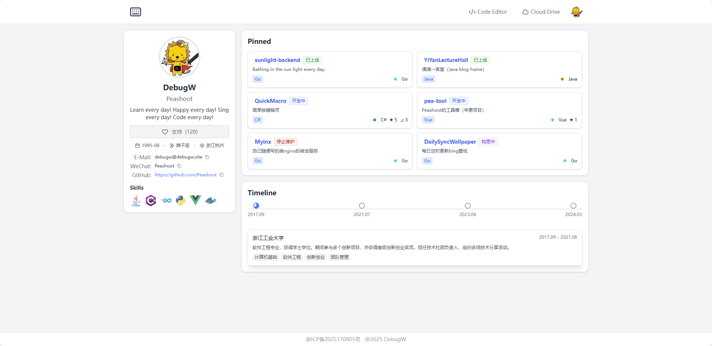

# Personal Homepage (GitHub Style)

一个使用 Vue 3 + TypeScript + Tailwind CSS 开发的个人主页项目，采用类似 GitHub 个人主页的设计风格。

## 🌟 特性

- 💻 使用 Vue 3 Composition API 和 TypeScript 开发
- 🎨 采用 Tailwind CSS 实现现代化 UI 设计
- 📱 完全响应式设计，支持各种设备
- �� 基于 Vite 构建，开发体验极佳
- 🔒 个人信息配置文件化，保护隐私

## 📸 项目截图

## 🔨 主要组件

### 顶部导航栏 (TopNavbar)
- 自定义键盘图标作为 Logo
- 快捷访问在线代码编辑器和网盘
- 个人头像展示

### 个人信息侧边栏 (ProfileSidebar)
- 个人头像和基本信息展示
- 支持按钮交互
- 联系方式展示（邮箱、微信、GitHub）
- 基本信息展示（出生年月、星座、籍贯）
- 技能标签展示（带图标和链接）

### 项目展示区 (PinnedProjects)
- 精选项目展示
- 项目状态标签（已上线、开发中、停止维护、构思中）
- 项目描述和链接

### 个人履历时间线 (PersonalResume)
- 横向时间线布局
- 自动轮播功能（10秒间隔）
- 支持手动切换
- 平滑的过渡动画

## 🛠️ 技术栈

- Vue 3.5.17
- TypeScript 5.8.3
- Tailwind CSS 3.3.5
- Vite 7.0.0

## 📦 安装和运行

1. 克隆项目
\`\`\`bash
git clone [repository-url]
\`\`\`

2. 安装依赖
\`\`\`bash
npm install
\`\`\`

3. 配置个人信息
\`\`\`bash
# 复制配置文件模板
cp src/config/profile.template.ts src/config/profile.ts

# 编辑 profile.ts 文件，填入您的个人信息
\`\`\`

4. 开发环境运行
\`\`\`bash
npm run dev
\`\`\`

5. 构建生产版本
\`\`\`bash
npm run build
\`\`\`

## 🔧 开发环境要求

- Node.js >= 16.0.0
- npm >= 7.0.0

## 📝 开发计划

- [ ] 添加深色模式支持
- [ ] 集成更多社交媒体链接
- [ ] 添加博客文章展示
- [ ] 优化移动端体验

## 🔒 个人信息配置

项目使用配置文件管理个人信息，以保护隐私：

1. 配置文件位置：
   - 模板文件：`src/config/profile.template.ts`
   - 实际配置：`src/config/profile.ts`（需要手动创建，已被 .gitignore 忽略）

2. 配置项说明：
   - `avatar`: 头像图片路径
   - `nickname`: 显示的昵称
   - `username`: 用户名
   - `bio`: 个人简介
   - `birthday`: 生日信息
   - `constellation`: 星座
   - `location`: 所在地
   - `contactInfo`: 联系方式列表
   - `skills`: 技能列表
   - `timeline`: 个人履历时间线

3. 使用方法：
   1. 复制模板文件：`cp src/config/profile.template.ts src/config/profile.ts`
   2. 编辑 `profile.ts`，填入个人信息
   3. 确保 `profile.ts` 已被 .gitignore 忽略，不会被提交到代码仓库

## �� 许可证

MIT License
